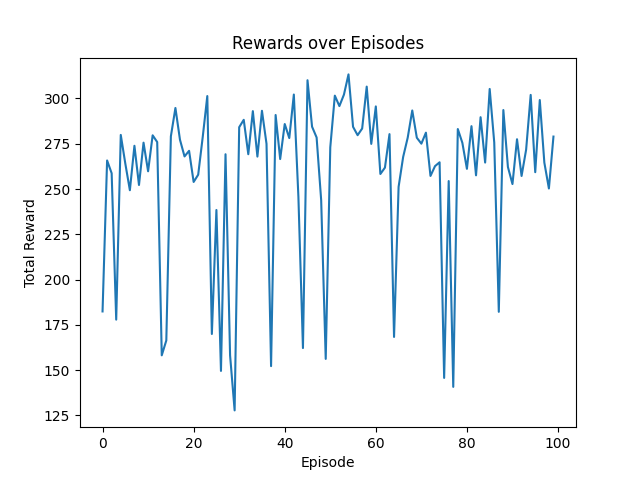

### Setting Up the Environment

To ensure smooth running of the code, follow these steps:

1. **Create a Virtual Environment:**
   ```bash
   conda create --name your_env_name python=3.8.18
   ```

2. **Activate the Virtual Environment:**
   ```bash
   conda activate your_env_name
   ```

3. **Install Dependencies:**
   ```bash
   pip install torch==1.9.1+cu117 -f https://download.pytorch.org/whl/cu117/torch_stable.html
   pip install gym
   pip install moviepy
   pip install matplotlib
   ```

### Running the Code

After setting up the environment, you can run the code using the following commands:

- **Training Script:**
   ```bash
   python train.py
   ```

- **Testing Script:**
   ```bash
   python test.py
   ```

### Lunar Lander Environment

The Lunar Lander environment is a 2D simulation of a lunar lander. The goal is to land the spacecraft on the landing pad, which is located between two flags. The environment is considered solved when the agent obtains an average reward of 200 over 100 consecutive episodes. The agent receives a reward of +100 for landing on the landing pad, a reward of -100 for crashing, and a reward of -0.3 for using the thrusters. The state space is continuous and has eight dimensions, and the action space is discrete and has four possible actions: do nothing, fire left thruster, fire main thruster, and fire right thruster.

### Deep Q-Network (DQN) Algorithm

The DQN algorithm is a model-free, off-policy, reinforcement learning algorithm that uses a deep neural network to approximate the Q-function. The Q-function is a function that maps a state-action pair to a value, which represents the expected total reward obtained by taking the action in the state and following the optimal policy thereafter. The DQN algorithm uses an experience replay buffer to store experiences and randomly sample batches of experiences during training. It also uses a target Q-network to compute the target Q-values, which are used to train the Q-network. The target Q-network is updated periodically to stabilize training.

### QNetwork

The `QNetwork` class defines the architecture of the deep neural network used for approximating the Q-function in the DQN algorithm. It is a feedforward neural network with three fully connected layers. The input layer size is determined by the `state_size`, and the output layer size corresponds to the number of possible actions (`action_size`). The activation function used between layers is the Rectified Linear Unit (ReLU).

### Replay Buffer

The `ReplayBuffer` class implements the Experience Replay Buffer, a crucial component in off-policy reinforcement learning algorithms like DQN. It uses a deque data structure to store experiences, and its purpose is to randomly sample batches of experiences during training. The buffer has a maximum capacity (`capacity`), and once it is full, new experiences replace the oldest ones.

### Target Network

The `TargetNetwork` class implements the target Q-network, which is used to compute the target Q-values during training. The target Q-network is a copy of the Q-network, and its weights are updated periodically to stabilize training.

### Training Function

The `train_dqn` function performs a single step of training on the Q-network. It retrieves a batch of experiences from the replay buffer, computes the loss using the Mean Squared Error (MSE) loss between the predicted Q-values and the target Q-values, and updates the Q-network's weights using backpropagation.

### Epsilon-Greedy Exploration

The exploration-exploitation strategy used in the training loop is epsilon-greedy. During each action selection, there is a probability `epsilon` of choosing a random action (exploration) and a probability of `1 - epsilon` of choosing the action with the maximum Q-value (exploitation). The value of `epsilon` starts high and decays over time.

### Reward System

The agent receives a reward of +100 for landing on the landing pad, a reward of -100 for crashing, and a reward of -0.3 for using the thrusters. The total reward accumulated during each episode is stored in the `total_reward` variable. The goal is to maximize this cumulative reward over episodes.

### Hyperparameters

- `learning_rate`: The learning rate used in the Adam optimizer.
- `gamma`: The discount factor for future rewards.
- `epsilon_start`: The initial exploration probability in epsilon-greedy.
- `epsilon_end`: The minimum exploration probability.
- `epsilon_decay`: The decay rate of the exploration probability.
- `target_update_frequency`: How often to update the target Q-network.
- `batch_size`: The size of the experience replay buffer batches used for training.
- `capacity`: The maximum capacity of the experience replay buffer.
- `num_episodes`: The total number of episodes to train the agent.
- `max_steps`: The maximum number of steps allowed per episode.
- `device`: The device used for training (CPU or GPU).

### Saving Videos

The code allows for saving videos of the Lunar Lander environment. Videos are saved in the `./videos` directory, and you can specify the episodes for which videos should be saved using the `episode_trigger_arr` array.

### CUDA Support

The code checks if a GPU is available and uses it for training if possible. The device is printed at the beginning of the execution.

### Training Loop

The main training loop iterates over episodes, each consisting of interacting with the environment, storing experiences in the replay buffer, and periodically updating the Q-network. The target Q-network is updated every `target_update_frequency` episodes. The epsilon value is decayed over time to shift from exploration to exploitation.

### Model Saving and Plotting

The trained Q-network's weights are saved to a file (`lunar_lander_dqn.pth`). The rewards obtained in each episode are plotted at the end of training, providing insights into the agent's learning progress.

### Testing Loop

The main testing loop iterates over episodes, each consisting of interacting with the environment and storing the total reward obtained. The trained Q-network's weights are loaded from the file (`lunar_lander_dqn.pth`).

### Results

The agent was able to solve the environment in 1,000 episodes, obtaining an average reward of 258 over 100 consecutive episodes. The plot below shows the rewards obtained in each episode during training.


